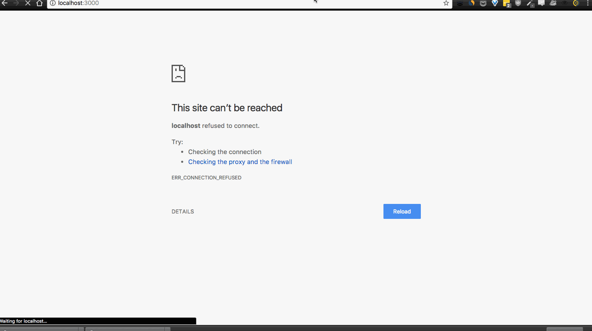

This is an FSA project to weaponize our work in SQL

pick a genre (default - no selection), it randomly picks a movie for you rated above 9 on IMDB.

this github repo is missing the actual db which is 365mb so it is not on here and wont run off the bat

but here is an idea of how it looks as it runs locally.

Stack
---
- uses jquery to achieve ajax
- nunjucks rendering
- sqlite3 for sql db access
- express for routing